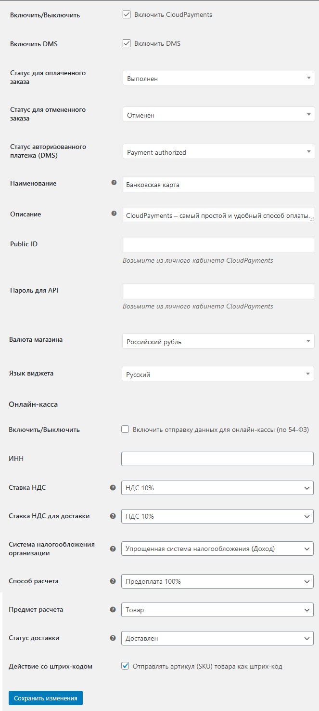
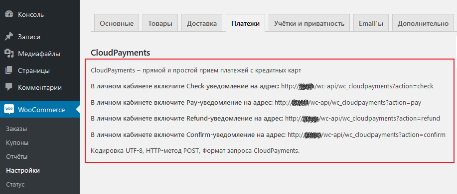

# CloudPayments module for WordPress - WooCommerce

Модуль позволит добавить на ваш сайт оплату банковскими картами через платежный сервис [CloudPayments](https://cloudpayments.ru/Docs/Connect). 
Для корректной работы модуля необходима регистрация в сервисе.
Порядок регистрации описан в [документации CloudPayments](https://cloudpayments.ru/Docs/Connect).

## Возможности:

* Одностостадийная схема оплаты;
* Двухстадийная схема;
* Информирование СMS о статусе платежа;
* Выбор языка виджета;
* Поддержка онлайн-касс (ФЗ-54);
* Отправка чеков по email;
* Отправка чеков по SMS;
* Отдельный параметр НДС для доставки.

## Совместимость:

WordPress 4.9.7 и выше;  
WooCommerce 3.4.4 и выше.

## Установка

Скопируйте папку `woocommerce-cloudpayments` в директорию `wp-content/plugins/` на вашем сервере.

Зайдите в "Управление сайтом" -> "Плагины". Активируйте плагин "WooCommerce CloudPayments Gateway".

В управлении сайтом зайдите в "WooCommerce" -> "Настройки" -> "Оплата" -> "CloudPayments". Отметьте галочкой  "Enable CloudPayments".

Настройте необходимые поля:  

* **Включить/Выключить** - Включение/Отключение платежной системы;  
* **Включить DMS** - Включение двухстадийной схемы оплата платежа (холдирование);
* **Статус для оплаченного заказа** - Выполнен (Если не предусматривается другой функционал);
* **Статус для отмененного заказа** - Отменен (Если не предусматривается другой функционал);
* **Статус авторизованоого платежа DMS** - Payment authorized (оплата подтверждена);
* **Наименование** - Заголовок, который видит пользователь в процессе оформления заказа;
* **Описание** - Описание метода оплаты;
* **Public_id** - Public id сайта из личного кабинета CloudPayments;
* **Password for API** - API Secret из личного кабинета CloudPayments;
* **Валюта заказа** - Российский рубль (Если не предусматривается использовать другие валюты);
* **Язык виджета** - Русский МСК (Если не предусматривается использовать другие языки).

Использовать функцуионал онлайн касс:
* **Включить/Выключить** - Включение/отключение формирования онлайн-чека при оплате;
* **Ставка НДС** - Укажите ставку НДС товаров;
* **Ставка НДС для доставки** - Укажите ставку НДС службы доставки;
* **Система налогооблажения организации** - Тип системы налогообложения;
* **Действие со штрих-кодом** - отправление артикула товара в чек как шрих-код.

Нажмите "Сохранить изменения".

В личном кабинете CloudPayments зайдите в настройки сайта, пропишите в настройках уведомления, как описано на странице настройки модуля на указанный адрес:  

Вы готовы принимать платежи с банковских карт с помощью CloudPayments!
